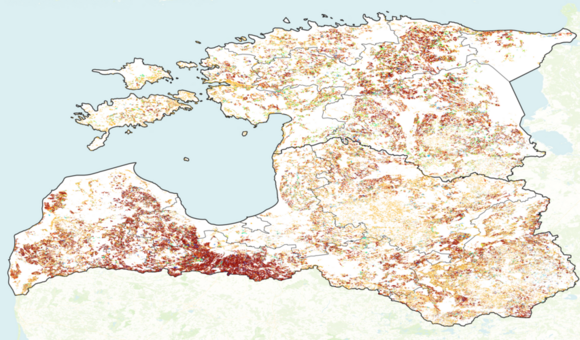
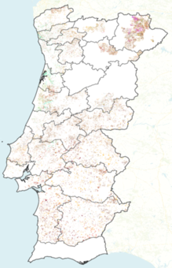

# EuroCropsML
*Ready-to-use benchmark dataset for few-shot crop type classification using Sentinel-2 imagery.*

*Part of the [PreTrainAppEO](https://www.asg.ed.tum.de/en/lmf/pretrainappeo/) ("Pre-Training Applicability in Earth Observation") research project.*

<!-- badges begin -->
[](https://eurocropsml.readthedocs.io/en/latest/?badge=latest)
[
](https://pypi.org/p/eurocropsml)
[](https://www.python.org)
[](LICENSE)
[
](https://zenodo.org/doi/10.5281/zenodo.10629609)
<!-- badges end -->

<!-- teaser-begin -->

`EuroCropsML` is a pre-processed and ready-to-use machine learning dataset for crop type classification of agricultural parcels in Europe.
It consists of a total of **706,683** multi-class labeled data points with a total of **176** distinct classes.
Each data point contains an annual time series of per parcel median pixel values of Sentinel-2 L1C reflectance data for the year 2021.
The dataset is based on [Version 9](https://zenodo.org/records/10118572) of [`EuroCrops`](https://github.com/maja601/EuroCrops), an open-source collection of remote sensing reference data.

For `EuroCropsML`, we acquired and aggregated data for the following countries:

| Country      | Total number of datapoints  | Number of distinct classes | 
|--------------|--------------------| -------------------------- |
| Estonia      |  175,906 | 127 |
| Latvia       | 431,143 | 103 |
| Portugal     | 99,634 | 79 |




The distribution of class labels differs substantially between the regions of Estonia, Latvia, and Portugal.
This makes  transferring knowledge gained in one region to another region quite challenging, especially if only few labeled data points are available.
Therefore, this dataset is particularly suited to explore transfer-learning methods for few-shot crop type classification. 

The data acquisition, aggregation, and pre-processing steps are schematically illustrated below. A more detailed description is given in the [dataset section](https://eurocropsml.readthedocs.io/en/latest/dataset.html) of our documentation.


<!-- teaser-end -->

## Getting Started

`eurocropsml` is a Python package [hosted on PyPI](https://pypi.org/project/eurocropsml/).

### Installation
The recommended installation method is [pip](https://pip.pypa.io/en/stable/)-installing into a virtual environment:

```console
$ python -Im pip install eurocropsml
```

### Usage Guide
The quickest way to interact with the `eurocropsml` package and get started is to use the `EuroCropsML` dataset is via the provided command-line interface (CLI).

For example, to **get help** on available commands and options, use
```console
$ eurocropsml-cli --help
```

To **show** the currently used (default) **configuration** for the `eurocropsml` dataset CLI, use
```console
$ eurocropsml-cli datasets eurocrops config
```

To **download** the EuroCropsML dataset as currently configured, use
```console
$ eurocropsml-cli datasets eurocrops download
```

Alternatively, the dataset can also be manually downloaded from our [Zenodo repository](https://zenodo.org/doi/10.5281/zenodo.10629609).

A comprehensive documentation of the CLI can be found in the [CLI Reference](https://eurocropsml.readthedocs.io/en/latest/cli.html) section of our documentation.

For a complete example use-case demonstrating the ready-to-use EuroCropsML dataset in action, please refer to the project's associated [official repository](https://github.com/dida-do/eurocrops-meta-learning) for benchmarking meta-learning algorithms.

## Project Information

The `eurocropsml` code repository is released under the [MIT License](LICENSE).
Its documentation lives at [Read the Docs](https://eurocropsml.readthedocs.io/en/latest/), the code on [GitHub](https://github.com/dida-do/eurocropsml) and the latest release can by found on [PyPI](https://pypi.org/project/eurocropsml/).
It is tested on Python 3.10+.

If you would like to contribute to `eurocropsml` you are most welcome. We have written a [short guide](CONTRIBUTING.md) to help you get started.

### Background

<!-- project-background-begin -->
The EuroCropsML dataset and associated `eurocropsml` code repository are provided and developed as part of the joint [PretrainAppEO](https://www.asg.ed.tum.de/en/lmf/pretrainappeo/) research project by the chair of [Remote Sensing Technology](https://www.asg.ed.tum.de/en/lmf/home/) at Technical University Munich and [dida](https://dida.do/).
<!-- project-background-middle -->

The goal of the project is to investigate methods that rely on the approach of pre-training and fine-tuning machine learning models in order to improve generalizability for various standard applications in Earth observation and remote sensing.

The ready-to-use EuroCopsML dataset is developed for the purpose of improving and benchmarking few-shot crop type classification methods.

`EuroCropsML` is based on [Version 9](https://zenodo.org/records/10118572) of [`EuroCrops`](https://github.com/maja601/EuroCrops), an open-source collection of remote sensing reference data for agriculture from countries of the European Union.
<!-- project-background-end -->

<!-- further-info-begin -->
## Citation
If you use the `EuroCropsML` dataset or `eurocropsml` code repository in your research, please cite our project as follows:

**Plain text**
```text
Reuss, J., & Macdonald, J. (2024). EuroCropsML [dataset]. Zenodo. https://doi.org/10.5281/zenodo.10629610
```
**Bibtex**
```text
@misc{reuss_macdonald_eurocropsml_2024,
  author       = {Reuss, Joana and Macdonald, Jan},
  title        = {EuroCropsML},
  year         = 2024,
  publisher    = {Zenodo},
  doi          = {10.5281/zenodo.10629610},
  url          = {https://doi.org/10.5281/zenodo.10629610}
}
```

## Acknowledgments & Funding
The [PreTrainAppEO](https://www.asg.ed.tum.de/en/lmf/pretrainappeo/) research project is funded by the German Space Agency at DLR on behalf of the Federal Ministry for Economic Affairs and Climate Action (BMWK).
<!-- further-info-end -->