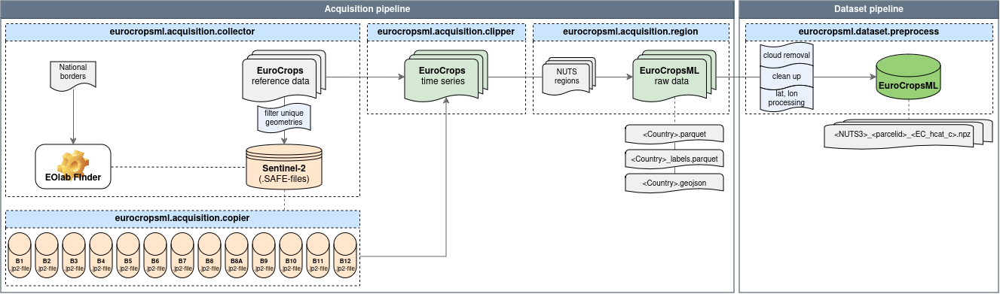

# EuroCropsML Dataset

## Project Background 
```{include} ../README.md
:start-after: 'project-background-begin -->'
:end-before: '<!-- project-background-end'
```

## Data Acquisition
In order to obtain the observation data for a given country and year, the following steps were caried out:
1. Collection of relevant Sentinel-2 tiles: Alignment of [$\texttt{EuroCrops}$](https://github.com/maja601/EuroCrops) [version 9](https://zenodo.org/records/8229128) reference data with Sentinel-2 raster data files.

    1.1 {any}`.SAFE files collection<eurocropsml.acquisition.collector>`: Request the necessary `.SAFE` files for the given year via an API request to the [EO-lab Data Explorer](https://explore.eo-lab.org/). All tiles that overlap the land surface of the country for a given year are collected.

    1.2 {any}`.SAFE files collection<eurocropsml.acquisition.collector>`: Mapping collected `.SAFE` files to each parcel individually by their geometries.

    1.3 {any}`Band image path collection<eurocropsml.acquisition.copier>`: Move all necessary `.SAFE` files to a local directory (if specified) to fasten up polygon clipping. Collect the individual band image paths of each `.SAFE` file.

2.  Clipping of satellite data and calculation of median pixel values.

    {any}`Polygon clipping<eurocropsml.acquisition.clipper>`: Clip parcels from the `.SAFE` files to obtain time series of corresponding reflectance data. As the dataset is intended to be used for crop type classification, we aggregated the collected pixel values. For every parcel and each available time step observation, we calculated the median pixel value for each of the 13 spectral bands of the Sentinel-2 raster tiles, as also done in the [tiny EuroCrops dataset](https://arxiv.org/abs/2106.08151). 

3.  Regional mapping: To enhance the precision of geographical data and facilitate the effective partitioning of the dataset, we utilized the [Eurostat GISCO database](https://ec.europa.eu/eurostat/de/web/gisco/geodata/statistical-units/territorial-units-statistics) to link the $\texttt{EuroCrops}$ parcels with their corresponding NUTS region. 

    {any}`NUTS regions<eurocropsml.acquisition.region>`: Add NUTS1-NUTS3 regions. The shapefiles for the NUTS-regions have been obtained from [Eurostat](https://ec.europa.eu/eurostat/de/web/gisco/geodata/statistical-units/territorial-units-statistics).

:::{note}
During step one, some parcels that lie at the intersection of two or multiple raster tiles, are first assigned to all of them.
In this case, only the raster tile with the lowest cloud coverage is kept for the following steps.
Thus, during clipping, only parts of the polygon are clipped and included in the calculation of the median pixel value.
However, since we are only relying on the median pixel value and not on individual pixel values, clipping only a part of the polygon in rare edge cases is sufficient.
Furthermore, the $\texttt{EuroCrops}$ sometimes contains duplicate parcel geometries. If this is the case, only one entry is kept.
:::




We provide all scripts that are necessary to perform the above steps. 

:::{note}
The scripts could be adapted accordingly in order to get similar data for other countries or years present in $\texttt{EuroCrops}$, either through EOLab or any other source that has Sentinel-2 `.SAFE` files available. 
as long as you have access to the necessary `.SAFE` files. Please create a separate configuration file in the directory `eurocropsml/configs/acquisition/cfg` for this.
The {any}`config module<eurocropsml.acquisition.config>` already contains the necessary information for the other available $\texttt{EuroCrops}$ countries. Please refer to the [official EuroCrops reference dataset](https://zenodo.org/records/10118572) for more reference data. Examples on how to customize the pipeline for collection additional data can be found in {doc}`Examples<examples>`.
:::

To run the data collection, you can use the provided {doc}`command-line interface (CLI)<cli>`.

The following commands provide further assistance:
```console
$ eurocropsml-cli --help
```

```console
$ eurocropsml-cli acquisition eurocrops --help
```

The default configuration `eurocropsml/configs/acquisition/config.yaml` collects data for Portugal. For the $\texttt{EuroCropsML}$ ROI countries Estonia, Latvia, and Portugal, there are predefined configuration files available in the `eurocropsml/configs/acquisition/cfg` directory that can be selected. For example, to collect data for Estonia:
```console
$ eurocropsml-cli acquisition eurocrops get-data cfg=estonia
``` 

:::{note}
If you want to get the data for another country, please first create a new acquisition configuration in the directory `eurocropsml/configs/acquisition/cfg`. You can then simply replace the default configuration with the one you created (${\textit{cf.}\,}$ {doc}`Examples<examples>`).
:::

## Data Preprocessing
The collected data needs further preprocessing in order to be used with most machine learning models.

To run the data preprocessing, you can use the provided {doc}`command-line interface (CLI)<cli>`.

The following command provides further assistance:
```console
$ eurocropsml-cli datasets eurocrops --help
```

During preprocessing, each data point is saved separately as a $\texttt{NumPy}$ `.npz` file along with metadata such as the spatial coordinates of the centroid of the parcel and the timestamp of each observation. The `.npz` files use the naming convention `<NUTS3-region>_<parcelID>_<EC_hcat_c>.npz`, where `EC_hcat_c` is the [$\texttt{EuroCrops}$ HCAT crop class code](https://arxiv.org/abs/2106.08151).

### Cloud Removal
Additionally, we perform a cloud removal step following the scene classification approach of the [Level-2A Algorithm](https://sentinels.copernicus.eu/web/sentinel/technical-guides/sentinel-2-msi/level-2a/algorithm-overview) (${\textit{cf.}\,}$ also [Level-2a Algorithm Theoretical Basis Document](https://step.esa.int/thirdparties/sen2cor/2.10.0/docs/S2-PDGS-MPC-L2A-ATBD-V2.10.0.pdf)). To detect clouds, we rely on the brightness thresholds of the red band (B4). If the median reflectance of the band is lower than the threshold $t_1=0.07$, we consider it as cloud-free and assign a cloud probability of 0%. If it is higher than the threshold $t_2=0.25$, it is considered cloudy and is assigned a cloud probability of 100%. Similarly, we linearly interpolate values between the aforementioned thresholds and assign probabilities between 0% and 100%. Consequently, all observations with a cloud probability greater than 50% are removed. The removal of the cloudy observations as well as the individual thresholds can be adjusted in the preprocess config (${\textit{cf.}\,}$ {doc}`Examples<examples>`).

### Further Notes
Please note that when creating training/validation splits for machine learning algorithms, there is an option for downsampling the class ${\texttt{pasture_meadow_grassland_grass}}$ during the pre-training phase of a transfer-learning scenario to the median frequency of all other classes. The downsampling can be turned off by removing the `meadow_class` parameter from the respective split configurations in the directory `eurocropsml/configs/dataset/split`. 


